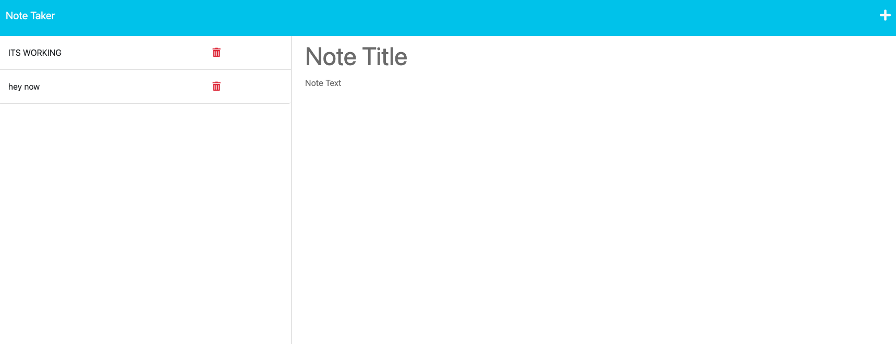

# Mod-11-note-taker

## Description

This is a simple note-taking application that allows small business owners to write and save notes, organize their thoughts, and keep track of tasks they need to complete.

## User Story

As a small business owner, I want to be able to write and save notes so that I can organize my thoughts and keep track of tasks I need to complete.

## Table of Contents

- [Installation](#installation)
- [Usage](#usage)
- [License](#license)

## Installation

To use the Note Taker app, the user needs to:

Clone this repository to their local machine.
Install the required dependencies using the `npm install` command.
Start the server using the `node server.js` command.

## Usage

Once the server is running, the user can access the Note Taker app by navigating to http://localhost:PORT (PORT will be the port number specified in the server.js file).

## License

## See file.
